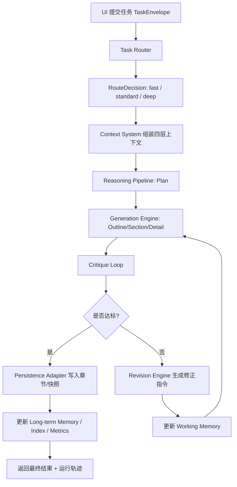

# Zide 产品与 AI Native 一体化重构方案

版本：v0.1  
日期：2026-03-08  
角色：产品经理 / 架构师 / AI 系统重构  
范围：重构 AI 内核，不重写现有桌面端、项目存储、导出和快照能力

---

## 产品起点

这次重构不能只回答“AI 怎么调度”，而要先回答“为什么作者会在通用 AI 之外专门打开 Zide”。

### 产品问题定义

如果目标是方案、报告、汇报这类功能型长文，通用 AI 已经足够强，Zide 很难建立明显优势。

但在长篇小说创作上，通用 AI 依然存在 5 个稳定短板：

1. 世界观和规则容易漂。
2. 人物说话方式和行为动机会失真。
3. 长线剧情推进容易断。
4. 伏笔、关系、时间线很难持续维护。
5. 中后期返工代价极高。

所以 Zide 更有机会的方向不是“通用长文 AI”，而是：

`AI Native 小说创作操作系统`

### 用户价值一句话

把小说创作从“边写边忘、越写越乱”变成“设定可记、剧情可推、问题可审、成稿可收口”的持续创作流程。

### 业务目标一句话

提升长篇小说项目的持续推进率、设定一致性和完稿率。

### 当前产品的核心偏差

当前产品把很多 AI 能力设计成了“按钮集合”，导致：

1. 作者要自己判断下一步该点哪个按钮。
2. 作者要自己承担“设定有没有冲突、人物有没有跑偏、剧情该不该改”的判断成本。
3. 系统更像“带 AI 的编辑器”，不像“能持续陪跑一部长篇小说的创作系统”。

---

## 主用户与主场景

### 主用户身份

| 用户 | 典型任务 | 时间压力 | 对系统的核心期待 |
|---|---|---|---|
| 长篇小说作者 | 网文、独立小说、同人长篇创作 | 中 | 世界观、人设、剧情长期稳定 |
| 轻小说/剧本式创作者 | 节奏更强的章节化叙事 | 中高 | 冲突和节拍推进清晰 |
| 编辑/审稿者 | 审设定、审逻辑、审版本 | 中 | 快速定位问题和回退版本 |

### 本期主锚点用户

建议把第一优先级锚定为：

`长篇小说作者`

原因：

1. 这是通用 AI 仍然明显不稳定的场景。
2. 最能放大 `Memory / Critique / Revise` 的价值。
3. 更容易建立和通用 AI 的差异化优势。

### 主场景

`作者有一个故事种子，希望把它持续推进成一部长篇小说，并在几十到上百章后仍然保持世界观、人物和剧情稳定。`

这个场景下，作者真正需要的不是“帮我多写一点”，而是：

1. 帮我把故事种子变成稳定设定。
2. 帮我把剧情骨架搭出来并持续推进。
3. 帮我及时发现设定冲突、人物偏移和时间线错误。
4. 帮我在中后期减少崩盘和返工。

---

## 目标体验地图

### 当前体验 vs 目标体验

| 阶段 | 用户目标 | 当前体验问题 | 目标体验 | AI 该承担的角色 |
|---|---|---|---|---|
| 灵感进入 | 把故事火花留下来 | 灵感容易散，设定起点不稳 | 系统先提炼故事核、主题和冲突 | Seed Router + Story Planner |
| 设定沉淀 | 稳住世界观和人设 | 设定分散、后面会忘 | 系统沉淀 Story Bible 和角色卡 | Context + Long-term Memory |
| 剧情架构 | 知道故事怎么走 | 大纲像标题，不像推进板 | 系统给卷/幕/章骨架和伏笔建议 | Planner + Plot Generator |
| 场景写作 | 稳定推进当前一场 | 作者卡文，不知道最该写什么 | 系统识别任务类型并选择写法 | Task Router + Generator |
| 连续性审查 | 防止写崩 | 检查和修复脱节，发现太晚 | 系统自动审设定、人物、时间线 | Critique Loop |
| 成稿收束 | 知道现在是否可连载/可完稿 | 只有导出，没有准备度判断 | 系统输出成稿准备度和阻塞问题 | Acceptance Gate + Manuscript Center |

### 目标体验原则

1. 作者负责创作方向，系统负责连续性维护。
2. 系统给阶段性结果，不赌一次性完美生成。
3. 每一步都可解释、可逆、可继续。
4. 长期记忆必须可见、可纠正。

---

## 产品模块划分

从产品视角看，Zide 不应该围绕“通用写作功能”组织，而应该围绕“小说持续创作阶段”组织。

| 产品模块 | 服务的用户阶段 | 产品职责 | 对应 AI 内核 |
|---|---|---|---|
| Story Bible Studio | 灵感进入 / 设定沉淀 | 把故事种子、世界观、角色、规则收敛为稳定底座 | Task Router + Planner |
| Plot Board | 剧情架构 | 生成、调整、确认卷/幕/章骨架和伏笔 | Generation Engine |
| Scene Sprint | 场景写作 | 以任务方式推进当前场景或章节 | Router + Context + Generator |
| Continuity Review | 连续性审查 | 自动评审设定冲突、人物偏移、时间线问题 | Critique Loop |
| Lore Memory Center | 记忆沉淀 | 展示长期稳定设定、角色、关系和时间线 | Context System |
| Manuscript Center | 成稿收束 | 判断当前是否适合继续连载或收口总修，并导出稿件 | Acceptance Gate + Export |
| Run Console | 运行透明 | 展示 route、plan、critique、revision 轨迹 | Run Trace |

### 产品层的关键改造

最重要的一条不是“多加几个 AI 功能”，而是把当前六个按钮式 AI 操作升级成小说作者能理解的三类任务型入口：

1. `快速润色`
   - 适合句子、语气、局部场景优化
2. `推进场景`
   - 适合继续写当前场景、补动作、补冲突、推进关系
3. `深改剧情`
   - 适合重写场景逻辑、调整人物动机、改关键剧情节点

这就是小说作者场景里的 `Task Router`。

---

## 信息架构

### 导航结构

```text
项目首页
  ├── Story Bible Studio   # 故事种子、世界观、角色、规则、风格
  ├── Plot Board           # 卷/幕/章节骨架、节拍、伏笔
  ├── Scene Sprint         # 场景推进区
  ├── Continuity Review    # 设定冲突、人物偏移、时间线问题
  ├── Lore Memory Center   # 已确认稳定记忆资产
  ├── Manuscript Center    # 成稿准备度、导出、快照
  └── Run Console          # 每次 AI 任务的执行轨迹
```

### 核心对象

| 对象 | 产品意义 |
|---|---|
| Story Bible | 这部小说的世界观、角色、规则和风格底座 |
| Plot Arc | 这部小说的剧情推进骨架 |
| Scene Goal | 当前场景或章节要完成什么 |
| Task Run | 一次 AI 写作任务的完整执行记录 |
| Continuity Report | 当前结果在哪些地方破坏了一致性 |
| Memory Card | 长期有效的设定、角色、关系、时间线和决策摘要 |
| Manuscript Readiness | 当前作品离“可继续连载/可完稿”还有多远 |

### 交互原则

1. 系统默认给“下一步最值得写的内容”，而不是只给功能面板。
2. 作者能看到“结果 + 原因 + 风险 + 下一步”。
3. 所有高风险 AI 操作都要有回滚入口。
4. Continuity Review 必须是主流程，不是边缘工具页。

---

## 版本策略与指标

### 版本策略

| 版本 | 目标 | 核心能力 |
|---|---|---|
| V3.0 Novel-first Product Reframe | 从通用长文工具升级为小说创作产品 | Story Bible、Plot Board、Scene Sprint |
| V3.1 AI Native Core | 建立 PEER 闭环 | Plan / Execute / Evaluate / Revise |
| V3.2 Lore Memory & Retcon | 做强长篇稳定性与后期维护 | 四层记忆、retcon、连续性门禁 |

### 核心指标

| 指标 | 定义 | 目标方向 |
|---|---|---|
| Scene Task Completion Rate | 场景任务被推进到可采纳结果的比例 | 提升 |
| First Pass Continuity Pass Rate | 首轮结果直接通过连续性门禁的比例 | 提升 |
| Average Revision Rounds | 达标前平均修正轮次 | 降低 |
| Plot Stall Ratio | 由于剧情目标不清导致的反复失败比例 | 降低 |
| Manual Rewrite Ratio | 作者完全手工重写的比例 | 降低 |
| Continuity Review Coverage | 被连续性审查覆盖的任务比例 | 提升到接近 100% |

---

## 0. 结论先行

当前仓库已经具备“长文工作台”的产品骨架，但 AI 运行时仍然是“单次 Prompt 调用器”，还不是成熟的 AI Native 系统。

核心原因不是功能少，而是 AI 内核缺了 5 个关键层：

1. 缺少 `Task Router`，所有任务几乎都直接走固定生成链路。
2. 缺少 `Reasoning Pipeline`，没有 `Plan -> Execute -> Evaluate -> Revise` 的闭环。
3. 缺少真正分层的 `Context System`，当前只是一次性把背景/大纲/术语/前文打包后塞进模型。
4. 缺少 `Generation Engine` 的层级生成，当前主要是章节级单轮生成。
5. 缺少 `Critique Loop`，生成结果会直接落盘，没有自动评审和回修。

因此，这个项目更准确的定位应是：

`长文生产工具 + 若干 AI 功能`

而不是：

`以推理、记忆、评审和修正为核心的 AI Native 长文系统`

---

## 1. 现状审计

### 1.1 已有基础

当前系统已经有这些可以保留的基础设施：

1. Electron + React 桌面壳。
2. `domain / application / infrastructure` 分层。
3. 文件型项目仓储、章节仓储、快照、导出。
4. 基础上下文检索与压缩。
5. 大纲、章节、检查、导出、指标等业务闭环。

这些都不用推倒重来。

### 1.2 当前关键问题

#### 问题 A：Agent 资产和运行时脱节

仓库里有完整的 `prompts/agents/*.prompt.md`，但运行时真正消费的是 `prompts/global/*`。  
这意味着现在的 “14 个 Agent” 更像文档资产，不是运行时 Agent 系统。

#### 问题 B：Strategy 没有真正接管生成器

项目已经有 `AIStrategyManager` 和 `StrategyAwareLLMAdapter`，但 AI 主链路创建 `GenerateContentUseCase` 时，仍然把原始 `llmAdapter` 直接注入。  
结果是：策略只影响了一部分上下文裁剪，没有真正影响模型选择、Prompt 规则、执行模式和评估门槛。

#### 问题 C：生成链路是单轮直写

当前主链路本质上是：

`读取章节 -> 打包上下文 -> 单次生成 -> 直接写章节 -> 更新索引`

这条链路没有：

1. 任务拆解。
2. 中间产物。
3. 自评。
4. 回修。
5. 终止条件。

#### 问题 D：上下文不是分层记忆系统

当前 `ContextPack` 只有：

1. `projectContext`
2. `outline`
3. `glossary`
4. `relatedChapters`

这还不是 AI Native 所需的四层上下文：

1. `system context`
2. `task context`
3. `working memory`
4. `long-term memory`

#### 问题 E：质量检查与生成脱钩

现在的检查模块更像“用户点击后运行的规则引擎”，而不是生成链路内的质量门禁。  
所以系统不能自动判断“这轮生成是否达标”“是否需要重试”“该如何修正”。

### 1.3 重构原则

本次建议不是“重写整个产品”，而是“保留业务骨架，替换 AI 内核”：

1. 保留项目、章节、快照、导出、设置、UI。
2. 保留本地文件存储。
3. 重构 AI 执行层、上下文层、Prompt 层、评估层。
4. 让 `prompt`、`schema`、`memory`、`trace` 成为一等公民。

---

## 2. 目标系统架构

### 2.1 总体架构

```text
┌──────────────────────────────────────────────────────────────┐
│ UI / IPC Layer                                              │
│ 项目页、章节页、任务面板、运行轨迹面板                        │
└──────────────────────────────────────────────────────────────┘
                          │
                          ▼
┌──────────────────────────────────────────────────────────────┐
│ AI Orchestrator                                              │
│ 统一接收任务，请求 Router，驱动 Plan/Execute/Evaluate/Revise │
└──────────────────────────────────────────────────────────────┘
                          │
        ┌─────────────────┼─────────────────┐
        ▼                 ▼                 ▼
┌──────────────┐  ┌──────────────┐  ┌──────────────┐
│ Task Router  │  │ Context Sys  │  │ Run Trace    │
│ 识别复杂度    │  │ 组装四层上下文 │  │ 记录步骤/输入输出│
└──────────────┘  └──────────────┘  └──────────────┘
        │                 │
        └──────────┬──────┘
                   ▼
┌──────────────────────────────────────────────────────────────┐
│ Reasoning Pipeline                                           │
│ Plan -> Execute -> Evaluate -> Revise                        │
└──────────────────────────────────────────────────────────────┘
                   │
     ┌─────────────┼─────────────┐
     ▼             ▼             ▼
┌───────────┐ ┌────────────┐ ┌──────────────┐
│ Generator │ │ Critique   │ │ Revision     │
│ 层级生成   │ │ 自动打分    │ │ 定向回修      │
└───────────┘ └────────────┘ └──────────────┘
                   │
                   ▼
┌──────────────────────────────────────────────────────────────┐
│ Persistence / Domain                                         │
│ Project / Outline / Chapter / Snapshot / Metrics / Export    │
└──────────────────────────────────────────────────────────────┘
```

### 2.2 核心设计思想

1. UI 不再直接调用“某个 AI 按钮”，而是提交 `TaskEnvelope`。
2. Router 决定这次任务走：
   - `fast-path`
   - `standard-path`
   - `deep-path`
3. Context System 按任务阶段动态组装四层上下文。
4. Generation Engine 先出骨架，再出段落，再出细节，而不是一次吐完整结果。
5. Critique Loop 先评估再决定是否写入。
6. 所有中间结果都可追溯、可回滚、可复盘。

---

## 3. 模块划分

## 模块划分

| 模块 | 职责边界 | 上游输入 | 下游输出 | 允许依赖 | 禁止依赖 |
|---|---|---|---|---|---|
| Task Router | 识别任务类型、复杂度、风险等级、推荐执行路径 | TaskEnvelope、项目状态、用户动作 | RouteDecision | Domain、Contracts、Memory 摘要 | 直接写章节、直接调用导出 |
| Reasoning Pipeline | 驱动 Plan -> Execute -> Evaluate -> Revise 循环 | RouteDecision、ContextSnapshot | RunResult、StepTrace | Router、Context、Generation、Critique | 直接操作 UI |
| Context System | 组装 system/task/working/long-term 四层上下文 | Project、Outline、Chapter、历史运行轨迹 | ContextSnapshot | Domain、Storage、Index、Memory | 直接决定写作策略 |
| Generation Engine | 层级生成 outline / section / detail / patch | ExecutionPlan、ContextSnapshot | GenerationArtifact | Prompt Registry、LLM、Contracts | 直接落盘章节 |
| Critique Loop | 评估覆盖率、一致性、证据、风格、格式并给出修正建议 | GenerationArtifact、TaskGoal、ContextSnapshot | CritiqueReport、RevisionDecision | Evaluation Rules、LLM、Contracts | 直接改项目元数据 |
| Working Memory Manager | 维护本轮任务短期记忆、子任务摘要、失败原因 | StepTrace、CritiqueReport | WorkingMemory | Context、Trace | 直接覆盖长程记忆 |
| Long-term Memory Manager | 存储稳定记忆：项目规则、章节摘要、用户偏好、术语决议 | Project data、Accepted artifacts | MemoryEntry[] | Storage、Index、Summarizer | 直接参与执行编排 |
| Prompt Registry | 管理 Router/Planner/Generator/Critic/Reviser 的 Prompt 与 Schema | Agent id、Prompt version | PromptSpec | Contracts、Templates | 直接落盘业务数据 |
| Run Trace / Observability | 记录每一步 input/output/token/latency/error | Pipeline events | RunTrace、Metrics、Replay | All AI core modules | 修改业务内容 |
| Persistence Adapter | 在通过质量门禁后才写入 Outline/Chapter/Snapshot | Accepted RunResult | 持久化结果 | Domain、Storage | 直接调用 LLM |

---

## 4. 数据流

### 4.1 章节生成主流程



### 4.2 四层上下文装配流

```text
system context
  = 产品固定规则 + 安全边界 + 输出 Schema + 当前 agent 角色约束

task context
  = 当前任务目标 + 用户指令 + 当前章节目标 + 当前路由策略

working memory
  = 本轮已完成子步骤摘要 + 上一次 critique 问题 + revision 指令 + 当前暂存结论

long-term memory
  = 项目背景 + 大纲 + 术语 + 已确认章节摘要 + 用户偏好 + 事实约束 + 历史决策
```

### 4.3 Router 决策规则

| 任务类型 | 复杂度 | 路由 | 典型场景 |
|---|---|---|---|
| micro-edit | 低 | fast-path | 润色、简化、局部改写 |
| chapter-write | 中 | standard-path | 单章节续写、补论证、扩写 |
| structure-change | 高 | deep-path | 重写章节结构、重做大纲、全局改稿 |
| diagnostic | 中 | standard-path | 全文检查、问题定位 |
| project-init | 中 | standard-path | 项目设定生成、大纲初始化 |

### 4.4 Plan -> Execute -> Evaluate -> Revise

| 阶段 | 目标 | 输出 | 失败兜底 |
|---|---|---|---|
| Plan | 明确任务边界，拆成 1-5 个子步骤 | ExecutionPlan | 输出最小可执行计划 |
| Execute | 按步骤调用生成器，产出结构化中间稿 | GenerationArtifact | 只生成当前步骤，不直接落盘 |
| Evaluate | 用规则 + LLM 双评估打分 | CritiqueReport | 至少返回问题清单 |
| Revise | 基于问题清单定向修复 | RevisionArtifact | 超过阈值次数则终止并提示人工介入 |

---

## 5. 示例 Prompt

下面给的是“运行时 Agent Prompt”的设计方式，不是文档型介绍 Prompt。

### 5.1 Task Router Prompt

```md
你是 Zide 的 Task Router。

你的职责只有一件事：判断当前任务应该走哪条执行路径。

## 输入
- user_action
- project_state
- chapter_state
- task_goal
- risk_signals

## 决策规则
1. 如果任务只涉及局部文本优化，选择 `fast-path`
2. 如果任务需要章节级生成，但不改变全局结构，选择 `standard-path`
3. 如果任务会影响大纲、跨章节一致性或需要多轮修正，选择 `deep-path`
4. 如果事实风险高、上下文冲突多、或历史失败 >= 2，复杂度至少提升一级

## 输出 JSON
{
  "taskType": "micro-edit | chapter-write | structure-change | diagnostic | project-init",
  "complexity": "low | medium | high",
  "route": "fast-path | standard-path | deep-path",
  "reason": "一句话解释为什么这么路由",
  "maxRevisionRounds": 0,
  "requiresCritique": true
}

禁止输出 JSON 以外的任何内容。
```

### 5.2 Planner Prompt

```md
你是 Reasoning Planner。

你的任务是把当前写作目标拆成最小可执行步骤，供后续生成器逐步执行。

## 约束
1. 不要直接写正文
2. 步骤数控制在 1-5 个
3. 每一步必须有明确目标和验收标准
4. 如果任务本身只需一步完成，也必须说明为什么可一步完成

## 输出 JSON
{
  "goal": "本轮任务目标",
  "steps": [
    {
      "stepId": "step-1",
      "objective": "本步骤目标",
      "generationMode": "outline | section | detail | patch",
      "acceptanceCriteria": [
        "验收标准1",
        "验收标准2"
      ]
    }
  ]
}
```

### 5.3 Section Generator Prompt

```md
你是 Section Generator。

你只负责当前步骤，不负责整章全局收尾。

## 你会收到
- system context
- task context
- working memory
- long-term memory
- current plan step
- output schema

## 生成原则
1. 先满足当前步骤 objective
2. 不得覆盖未授权段落
3. 如果信息不足，输出占位并显式说明缺口
4. 结果必须能被 Critique 模块评估

## 输出 JSON
{
  "artifactType": "section-draft",
  "content": "Markdown 正文",
  "coverage": ["覆盖了哪些目标点"],
  "openQuestions": ["仍未解决的问题"],
  "memoryPatch": "建议写入 working memory 的摘要"
}
```

### 5.4 Critic Prompt

```md
你是 Critique Agent。

你的任务不是改写正文，而是判断当前产物是否可以进入持久化阶段。

## 评分维度
1. goal_coverage
2. consistency
3. evidence_safety
4. structure_quality
5. style_alignment

## 输出 JSON
{
  "passed": false,
  "score": 78,
  "blockingIssues": [
    {
      "type": "coverage_gap",
      "message": "章节目标中的“实施成本”尚未覆盖",
      "repairInstruction": "补一段关于成本组成和边界条件的说明"
    }
  ],
  "minorIssues": [],
  "revisionAdvice": "下一轮只修 coverage_gap，不重写整章"
}
```

### 5.5 Reviser Prompt

```md
你是 Revision Agent。

你只能根据 CritiqueReport 中的 blockingIssues 定向修复，不允许重新自由发挥。

## 输出 JSON
{
  "artifactType": "revision-patch",
  "changeStrategy": "patch",
  "patchedContent": "修复后的正文或补丁段落",
  "resolvedIssues": ["coverage_gap"],
  "unresolvedIssues": []
}
```

---

## 6. 代码结构

建议保留当前 monorepo 和分层，只把 AI 内核重构为明确的子模块。

## 目录结构

```text
Zide/
  apps/
    desktop/                              # 保留：Electron 主应用
      src/
        main/
          ipc/                            # 保留：IPC 接口层，改为提交 TaskEnvelope
          ai-runtime/                     # 新增：主进程 AI 运行时装配
            createTaskRunner.ts          # 创建统一任务运行器
            createContextSystem.ts       # 创建上下文系统
            createPromptRegistry.ts      # 注册 prompt + schema
        renderer/
          features/
            ai-runs/                     # 新增：运行轨迹、质量报告、人工接管 UI
  packages/
    domain/                              # 保留：业务实体 + AI 核心对象
      src/
        entities/
        ai/
          TaskEnvelope.ts                # 新增：任务输入对象
          RouteDecision.ts               # 新增：路由决策
          ExecutionPlan.ts               # 新增：计划对象
          ContextSnapshot.ts             # 新增：四层上下文快照
          GenerationArtifact.ts          # 新增：生成中间产物
          CritiqueReport.ts              # 新增：评审结果
          RunTrace.ts                    # 新增：运行轨迹
    application/                         # 保留：用例层，新增 AI Native 工作流
      src/
        ai-native/
          router/
            RouteTaskUseCase.ts          # 新增：任务路由
          pipeline/
            RunTaskPipelineUseCase.ts    # 新增：总编排
            ExecutePlanStepUseCase.ts    # 新增：执行单步
            EvaluateArtifactUseCase.ts   # 新增：评审单步
            ReviseArtifactUseCase.ts     # 新增：回修单步
          context/
            BuildContextUseCase.ts       # 新增：组装四层上下文
            UpdateWorkingMemoryUseCase.ts# 新增：更新工作记忆
          generation/
            GenerateOutlineUseCase.ts    # 新增：层级生成入口
            GenerateSectionUseCase.ts    # 新增：章节段落生成
            GenerateDetailUseCase.ts     # 新增：细节补全
          persistence/
            PersistAcceptedArtifact.ts   # 新增：质量门禁后写入
    infrastructure/                      # 保留：适配器层
      src/
        llm/
          LLMGateway.ts                  # 新增：统一模型调用、重试、日志
          PromptRegistry.ts              # 新增：Prompt 版本管理
          SchemaValidator.ts             # 新增：输出结构校验
        memory/
          WorkingMemoryStore.ts          # 新增：短期记忆仓储
          LongTermMemoryRepo.ts          # 新增：长期记忆仓储
          MemorySummarizer.ts            # 新增：将章节/运行结果压缩入记忆
        evaluation/
          CritiqueEngine.ts              # 新增：规则 + LLM 双评审
          AcceptanceGate.ts              # 新增：是否允许持久化
        tracing/
          RunTraceRepo.ts                # 新增：运行轨迹落盘
          LLMCallLogger.ts               # 新增：记录 Input/Output
        adapters/
          ChapterPersistenceAdapter.ts   # 新增：通过门禁后写章节
    shared/
      src/
        contracts/
          ai/                            # 新增：所有 agent 输出 schema
        constants/
          aiThresholds.ts                # 新增：评审阈值
  prompts/
    runtime/                             # 新增：真正供运行时使用
      router/
      planner/
      generator/
      critic/
      reviser/
    global/                              # 保留：通用基础规则
    agents/                              # 保留：历史资产，迁移完成前不再作为主运行时入口
  docs/
    AI_NATIVE_REDESIGN.md                # 新增：本方案
```

要求：

1. `prompts/runtime/` 才是运行时主入口。
2. `prompts/agents/` 可以保留作历史资产和迁移对照。
3. 所有运行时 agent 必须绑定 `schema`。
4. IPC 层不再直接调用 `GenerateContentUseCase`，而是调用统一 `RunTaskPipelineUseCase`。

---

## 7. 文件职责

## 文件职责

| 文件路径 | 所属模块 | 文件职责 | 输入 | 输出 | 维护边界 | 回归检查点 |
|---|---|---|---|---|---|---|
| `apps/desktop/src/main/ai-runtime/createTaskRunner.ts` | AI Orchestrator | 组装 Router、Context、Pipeline、Persistence | IPC task request | TaskRunner | 不写业务规则 | 不同任务类型都能跑通 |
| `packages/application/src/ai-native/router/RouteTaskUseCase.ts` | Task Router | 识别复杂度并输出路径 | TaskEnvelope | RouteDecision | 只做决策，不执行生成 | 路由结果稳定且可解释 |
| `packages/application/src/ai-native/context/BuildContextUseCase.ts` | Context System | 组装四层上下文 | Project/Outline/Chapter/Memory | ContextSnapshot | 不负责模型调用 | ContextSnapshot 字段完整 |
| `packages/application/src/ai-native/pipeline/RunTaskPipelineUseCase.ts` | Reasoning Pipeline | 驱动 PEER 闭环 | RouteDecision、ContextSnapshot | RunResult | 不直接落盘正文 | revise 次数和停止条件正确 |
| `packages/application/src/ai-native/generation/GenerateSectionUseCase.ts` | Generation Engine | 执行单步章节生成 | PlanStep、ContextSnapshot | GenerationArtifact | 不负责最终采纳 | 中间产物结构合法 |
| `packages/infrastructure/src/evaluation/CritiqueEngine.ts` | Critique Loop | 规则 + LLM 双评审 | Artifact、Goal、Context | CritiqueReport | 不直接修正文稿 | blockingIssues 稳定输出 |
| `packages/infrastructure/src/evaluation/AcceptanceGate.ts` | Critique Loop | 判断是否达标、是否继续 revise | CritiqueReport | GateDecision | 不做生成 | 阈值触发正确 |
| `packages/infrastructure/src/memory/WorkingMemoryStore.ts` | Working Memory | 存储单次运行短期记忆 | StepTrace、MemoryPatch | WorkingMemory | 不负责长期摘要 | 多轮 revise 后内容可追溯 |
| `packages/infrastructure/src/memory/LongTermMemoryRepo.ts` | Long-term Memory | 存储稳定记忆条目 | Accepted result、Project facts | MemoryEntry[] | 不存临时草稿 | 被检索内容可解释 |
| `packages/infrastructure/src/llm/PromptRegistry.ts` | Prompt Registry | 装载 prompt、版本、schema | agentId、version | PromptSpec | 不负责业务路由 | prompt/schema 能正确匹配 |
| `packages/infrastructure/src/tracing/LLMCallLogger.ts` | Observability | 记录每次模型调用输入输出摘要 | prompt、response、latency | trace log | 不改变执行结果 | 每次 LLM 调用都留痕 |

---

## 8. 核心对象草案

## 核心对象草案

| 对象名 | 类型(Entity/ValueObject/Event/Config) | 所属模块 | 关键字段 | 生命周期/状态流转 | 关系约束 | 真相源 |
|---|---|---|---|---|---|---|
| TaskEnvelope | ValueObject | Router | taskId, taskType, userIntent, targetRef, userInstruction | UI 提交时创建，任务结束后归档 | 一个任务只能对应一个主目标对象 | IPC 请求 |
| RouteDecision | ValueObject | Router | complexity, route, requiresCritique, maxRevisionRounds | Router 输出后冻结 | 只能由 Router 生成 | Router |
| ExecutionPlan | Entity | Pipeline | planId, steps[], acceptanceCriteria | Plan 生成后可被 revise 缩减 | steps 需有序且可执行 | Planner |
| ContextSnapshot | ValueObject | Context | systemContext, taskContext, workingMemory, longTermMemory | 每轮 execute/evaluate 前生成 | 必须可序列化和追溯来源 | Context System |
| WorkingMemory | Entity | Memory | runId, stepSummaries, knownIssues, temporaryDecisions | 运行中持续更新，结束后清理或归档摘要 | 仅服务当前 run | WorkingMemoryStore |
| MemoryEntry | Entity | Long-term Memory | memoryId, scope, summary, confidence, sourceRefs | 被接受结果后写入，后续可再摘要 | 只能存稳定结论，不存临时失败稿 | LongTermMemoryRepo |
| GenerationArtifact | Entity | Generation | artifactId, artifactType, content, coverage, openQuestions | 每个 execute 步骤生成 | 不可直接替代最终章节 | Generation Engine |
| CritiqueReport | Entity | Critique | score, passed, blockingIssues, minorIssues, revisionAdvice | 每轮评审生成 | 必须关联 artifactId | Critique Engine |
| RevisionDecision | ValueObject | Critique | action, targetIssues, retryCount | Evaluate 后生成 | retryCount 受 RouteDecision 限制 | AcceptanceGate |
| RunTrace | Entity | Observability | runId, steps, llmCalls, errors, finalStatus | 任务开始创建，结束封存 | 每个 step 必须可追溯 | RunTraceRepo |
| PromptSpec | Config | Prompt Registry | agentId, version, systemPrompt, schema, fallbackPolicy | 热更新或版本切换时替换 | 一个 agent + version 唯一 | PromptRegistry |

---

## 9. Prompt 与 Schema 设计规则

这部分是新系统是否成熟的关键门禁。

### 9.1 强制规则

1. 每个运行时 agent 只能承担单一职责。
2. 每个 agent 必须绑定输出 schema。
3. 每次 LLM 调用必须记录：
   - 输入摘要
   - 输出摘要
   - tokens
   - latency
   - prompt version
4. 任一 schema 解析失败，必须：
   - 记录失败日志
   - 触发 fallback prompt 或最小保守结果
   - 禁止把脏结果直接落盘

### 9.2 运行时 Prompt 分层

| 层 | 作用 |
|---|---|
| global/base | 产品通用规则、安全边界、输出基本要求 |
| runtime/router | 任务识别与复杂度决策 |
| runtime/planner | 拆步骤、定验收标准 |
| runtime/generator | 单步生成正文或结构产物 |
| runtime/critic | 自动评审、打分、问题定位 |
| runtime/reviser | 按 critique 定向修补 |

### 9.3 不再推荐的方式

1. 用一个 Prompt 同时兼顾“规划 + 写作 + 检查 + 修正”。
2. 用自然语言约定结构化输出，但没有 schema 校验。
3. 把 `intent=polish` 当作“大纲生成”或“对话兜底”的通用入口。

---

## 10. 与现有仓库的映射关系

### 10.1 保留模块

这些模块建议保留并继续复用：

1. `Project / Outline / Chapter / Snapshot / Export` 领域对象。
2. `FileProjectRepo / FileChapterRepo / FileOutlineRepo / FileSnapshotRepo`。
3. Electron IPC、Preload、Renderer 基础设施。
4. 现有快照、导出、统计能力。

### 10.2 重构模块

这些模块建议重构或降级为旧链路：

1. 现有 `GenerateContentUseCase`：
   - 从“主执行入口”降为“低层写作能力”
2. 现有 `ContextUseCases`：
   - 升级为四层上下文系统
3. 现有 `RealLLMAdapter`：
   - 升级为 `LLMGateway + PromptRegistry + SchemaValidator + CallLogger`
4. 现有 `CheckUseCases / SimpleRuleEngine`：
   - 并入 Critique Loop，成为规则评审子模块

### 10.3 历史 Prompt 迁移策略

| 当前资产 | 迁移去向 |
|---|---|
| `prompts/global/chapter-*.prompt.md` | 迁移为 `runtime/generator/*` |
| `prompts/agents/content-orchestrator-agent.prompt.md` | 拆成 Router / Planner / Pipeline Prompt |
| `prompts/agents/quality-check-agent.prompt.md` | 拆成 Critic Prompt + Acceptance rules |
| `prompts/agents/context-engine-agent.prompt.md` | 转成 Context Builder 规则，而不是自然语言 Prompt 主导 |

---

## 11. 下一步开发入口

## 下一步开发入口

- [ ] Step 1: 建立统一任务入口 `TaskEnvelope -> RunTaskPipelineUseCase`
  - 目标：把现在分散的 `ai:continue / ai:rewrite / ai:chat` 收口为统一任务模型
  - 前置依赖：保留现有 IPC，但新增 AI runtime 装配层
  - 变更范围：`apps/desktop/src/main/ipc/ai.ts`、`packages/application/src/ai-native/pipeline`
  - 验收标准：任一 AI 操作都先形成 `TaskEnvelope` 和 `RunTrace`
  - 回滚点：保留旧 `GenerateContentUseCase` 直连模式作为 fallback

- [ ] Step 2: 落地四层 Context System
  - 目标：把当前平铺 `ContextPack` 升级为 `ContextSnapshot`
  - 前置依赖：定义 `WorkingMemory`、`MemoryEntry`、`ContextSnapshot` 对象
  - 变更范围：`packages/domain/src/ai`、`packages/application/src/ai-native/context`、`packages/infrastructure/src/memory`
  - 验收标准：每次任务都能看到 system/task/working/long-term 四层输入
  - 回滚点：保留旧 `SimpleIndexAdapter.packContext()`

- [ ] Step 3: 接入 Critique Loop，禁止未评审结果直接落盘
  - 目标：把“生成即写入”改为“评审通过后写入”
  - 前置依赖：`GenerationArtifact`、`CritiqueReport`、`AcceptanceGate`
  - 变更范围：`packages/application/src/ai-native/pipeline`、`packages/infrastructure/src/evaluation`
  - 验收标准：生成结果不达标时会自动 revision，达标后才写章节
  - 回滚点：通过 feature flag 切回旧链路

- [ ] Step 4: 重建运行时 Prompt Registry + Schema Validator
  - 目标：让 `prompts/runtime/*` 成为真实运行时资产，而不是文档资产
  - 前置依赖：确定 Router / Planner / Generator / Critic / Reviser 五类 schema
  - 变更范围：`prompts/runtime`、`packages/infrastructure/src/llm`
  - 验收标准：任一 agent 输出都可校验、可重试、可追踪版本
  - 回滚点：保留 `prompts/global/*` 作为兼容 fallback

- [ ] Step 5: 增加 AI 运行轨迹面板
  - 目标：让用户看到“系统为什么这样写、哪里被判不通过、改了几轮”
  - 前置依赖：`RunTraceRepo` 已落盘
  - 变更范围：`apps/desktop/src/renderer/features/ai-runs`
  - 验收标准：用户能查看 route、plan、critique、revision 摘要
  - 回滚点：先只读日志，不影响章节编辑主流程

---

## 12. 推荐实施顺序

推荐顺序是：

1. 先做统一任务入口。
2. 再做四层上下文。
3. 再接 critique loop。
4. 最后替换 Prompt 运行时和 UI 轨迹面板。

原因很简单：

如果不先统一任务入口，后面的 Router、Memory、Critique 都会继续被旧接口打散；  
如果不先建立上下文分层，后面的 Plan/Revise 仍然只是在一个扁平 Prompt 上打补丁。

---

## 13. 一句话定版

Zide 下一阶段不应该继续堆“更多 AI 按钮”，而应该升级成：

`一个以任务路由、分层记忆、推理闭环、自动评审、可追踪运行轨迹为核心的 AI Native 长文生产系统`
